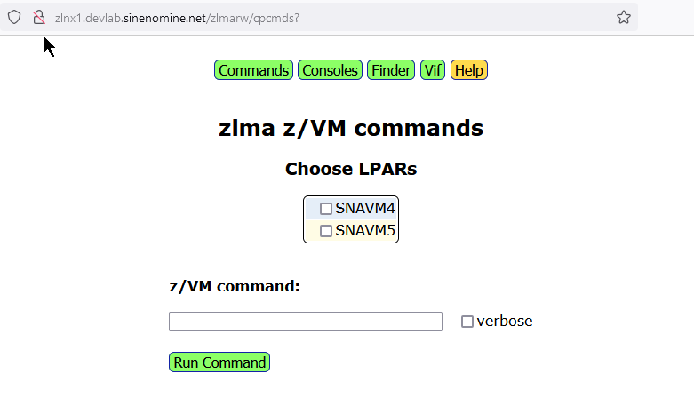

# z/VM and Linux Modern Administration 
z/VM and Linux Modern Administration (**zlma**, pronounced "zelma") is free and open software 

<b>What is it?</b>

It is code that allows Linux professionals running under z/VM on IBM mainframes be more productive, doing administration and monitoring from a browser, without the need to log in to green screens.

<b>Why do this?</b>

z/VM needs reinvention if it is to continue.  There must be alternatives to  interfaces designed in the 1970s.

<b>Status</b>

Web UI code is mostly written but the VIF backend is not.

## Goals
Zlma strives to be modern, centralized, simple, well-architected and secure:

- To be **modern**:
  - Perform most z/VM and Linux administration from a browser 
  - Avoid 3270 "green screens" as much as possible 
- To be **centralized**:
  - Keep all CMDB data on two servers (primary and hot standby)
  - Keep all z/VM Console data in the same two places
- To be **simple**:
  - As few web pages and menu items with no drop-down menus 
  - A simple 5-button menu at top of all web pages 
  - No fancy frameworks to create Web pages, just plain basic code 
  - One config file: ``/etc/zlma.conf``
  - One log file directory: ``/var/log/zlma``
- To be **well-architected**:
  - Centralized data in a fast, reliable relational database
  - Cross-LPAR communication using ssh: and https:
  - One Linux administration server per z/VM LPAR
  - Mostly object-oriented Python code, version 3.10 or greater
  - Roles:
    - Web UI performs presentation
    - Line commands do the heavy lifting
    - RESTful API for cross-LPAR communicaiton
  - Context-sensitive help documentation, all pointing to this README
- To be **secure**:
  - Web-facing Linux servers 
    - Have limited privileges
    - Interface to a CMS virtual machine with limited commands
  - Detailed log files with audit trail of all operations

## Components
It consists of these main components:
- A relational database
  - Containing pertinent up-to-date data about Linux servers on z
- Web browser interfaces
  - ``Commands`` - run z/VM commands
  - ``Consoles`` - view z/VM console data
  - ``Finder`` - search the configuration management database (CMDB)
  - ``VIF`` - The Virtual Image Facility abstracts z/VM function
- Linux line commands
  - ``zlma`` - manage DB of zLinux data
  - ``vif`` - manage many aspects of z/VM
  - console related commands such as ``spoolcons`` and ``lscons``
- Virtual Image Facility (VIF)
  - An abstraction of all z/VM function and administration
- A RESTful API
  - So other apps can get to the data

# Overview
Following is a block diagram of zlma:

 

**zlma block diagram**

# Preparing for installation 

The script ``instzlma`` allows for easy installation.  There are prerequisites as follow. 

This code has been tested on Debian-based (Ubuntu server 22.04) and RHEL-based (AlmaLinux 9.4) distros, both zLinux (s390x architecture).  When there are differences, separate steps are given for each. 

## Set up SSH access
Key-based authentication, or *Passwordless* SSH access is needed for one user from the zlma server to all systems that will be managed.  ``zlma`` commands must be run by that user and they must have ``sudo`` access.  

Once SSH access is set up, zlma can be installed. 

## Update your system
If this is a fresh install of Linux, it is best to update your system. To do so, perform the following steps:

- Login as a non-root user with sudo privileges. 

  - For Debian-based systems, run these commands:
    ```
    sudo apt update;
    sudo apt upgrade -y
    ```

  - For RHEL-based systems, run this command:
    ```
    sudo dnf update 
    ```

# Install basic packages
To install this ``zlma`` repository, some basic packages are first needed.

- Install git, vim and Apache.

  - For Debian-based:
    ```
    sudo apt install -y git vim apache2
    ```

  - For RHEL-based:
    ```
    sudo dnf install -y git vim httpd 
    ```

## Configure sudo
Set ``sudo`` so authorized users are not challenged first:

- Set vim to be the system editor:

```
sudo update-alternatives --install /usr/bin/editor editor /usr/bin/vim 100
```

- Edit the sudoers file:

```  
sudo visudo
```

  - Add the text ``NOPASSWD:``. For Debian-based, it is usually the ``sudo`` group:
    ```
    ...
    %sudo   ALL=(ALL:ALL) NOPASSWD: ALL
    ...
    ```

  - Add the text ``NOPASSWD:``. For RHEL-based, it is the usually the ``wheel`` group:
    ```
    ...
    %wheel  ALL=(ALL)       NOPASSWD: ALL
    ...
    ```

## Install this repository

- Clone this repo to your home directory:

```
git clone https://github.com/openmainframeproject/zvm-community-tools
```

## Update the main user 
The main user should not be root.  When ``zlma`` processes are running from Apache, they will run as a different user that usually cannot log on interactively. Add this group to the main user. The group ``apache`` is used on Red Hat-based distros, and for Debian, the group ``www-data`` is used.

- Add the group which will be running apache to the main non-root user. 

```
sudo usermod -aG <apache|www-data> <your-user>
```

- Use the ``su -`` command to start a new shell which will reflect the group added. In this example, the user is ``mikemac`` and the new group is ``apache``.

```
su - mikemac
id
uid=1000(mikemac) gid=1000(mikemac) groups=1000(mikemac),10(wheel),48(apache)
```

This shows that the group ``apache`` has been added to the user ``mikemac``.

## Upgrade Python
Python must be at level 3.10 or greater because zlma code uses ``match/case`` statements which are not supported in Python 3.9 or earlier. In this example, AlmaLinux 9.4 ships with a base Python version of 3.9 which is not sufficient.

- First, determine the Python version of your system: 

```
python -V
Python 3.9.18
```


To install Python 3.11 on a RHEL based distro, perform the following steps.

- Install Python 3.11

```
sudo dnf install -y python3.11 python3.11-devel
```

- Show the new version:

```
python3.11 -V
Python 3.11.7
```

If you need to use Python 3.11, it will be specified later.


# Automated Installation
To install zlma, perform the following sections. 

## Run the install script
The script ``instzlma`` is provided to save you time and improve reliability. 

- Run the script 

```
cd ~/zvm-community-tools/zlma/
./instzlma
Detected s390x (mainframe) architecture

Step 1): Installing packages ...
  Running: sudo apt install -y apache2 cifs-utils cmake curl gcc git jq locate make libmariadb-dev mariadb-server net-tools pandoc python3 python3-dev python3-pip
...

Step 2): Setting Apache and mariadb to start at boot time ...
  Running: sudo systemctl enable apache2
...

Step 3): Creating directories ...
  directory /srv/www/zlma already exists
  directory /srv/www/zlmarw already exists
  directory /var/log/zlma already exists
  directory /srv/consolez already exists

Step 4): Modifying directory /var/log//var/log/apache2 ...
  Running: sudo chown www-data:www-data /var/log/apache2
  Running: sudo chmod 750 /var/log/apache2

Step 5): Copying CGI files from repo to /srv/www ...
  Running: sudo cp * /srv/www/zlma
  Running: sudo chown www-data.www-data *
  Running: sudo cp * /srv/www/zlmarw
  Running: sudo chown www-data.www-data *

Step 6): Copying scripts from repo to /usr/local/sbin ...
...

Step 7): Creating symbolic links ...
 ...

Step 8): Creating virtual environment ...
  Running: sudo python3 -m venv venv
  Running: sudo chown -R www-data:www-data /srv/venv
  Running: sudo chmod -R g+w /srv/venv

Step 9): Activating venv ...
  Running: source /srv/venv/bin/activate

Step 10): Upgrading pip ...
  Running: python3 -m pip install --upgrade pip
...

Step 12): Installing pip packages ...
...

Step 13): Configuring Apache
  Running: sudo chmod 770 /var/log/apache2

Step 14): Customizing environment ...
  Running: sudo cp /home/mikemac/zlma/bash_profile /home/mikemac/.bash_profile
  Running: sudo mv indent.vim indent.vim.dontuse
  Running: sudo cp /home/mikemac/zlma/zlma.conf /etc/

Step 15): Opening firewall and SE Linux ...

Step 16): restarting mariadb and Apache and checking status...
  Running: sudo systemctl restart mariadb
  Status:      Active: active (running) since Tue 2025-07-22 13:14:17 EDT; 409ms ago
  Running: sudo systemctl start apache2
  Status:      Active: active (running) since Tue 2025-07-22 09:29:02 EDT; 3h 45min ago

Successfully installed zlma co-reqs in 4:21
Log file: /home/mikemac/25-07-22-13-09-57-instzlma.out
```

Output will be written to a file of the form ``$HOME/<yr-mon-day-hr-min-sec>-instzlma.out``.  It is recommended you review the output file checking for warnings or errors.


### Set mariadb root password
The mariadb root password is set manually.

- Set the mariadb root password. This must be the same user and password as in ``/etc/zlma.conf``. Enter the MariaDB command-line tool:

```
sudo mariadb
```

- From there, change the root password, then leave the session: 

```
ALTER USER 'root'@'localhost' IDENTIFIED BY 'new_password';
exit
```

### Update the zlma.conf file
The ``zlma.conf`` configuration file was copied to ``/etc``.  Set the following values: 
- db_user
  - The SQL database user, usually ``root``
- db_pw
  - The SQL password for the user, must be set manually
- db_host
  - Where mariadb is running, usually locally 
- db_name
  - The mariad database where the data is stored
- home_dir
  - The home directory where the ``zlmainfo`` script will be stored and run from
- log_level
  - Log file verbosity: error (lowest verbosity), warning, info, debug (highest verbosity)
- zlma_srvrs
  - List of LPAR/zlma server pairs - one zlma server per LPAR is required
- feilong_url
  - url of the feilong api

```
# vi /etc/zlma.conf
{
  "db_user":   "root",
  "db_pw":     "your_pw",
  "db_host":   "127.0.0.1",
  "db_name":   "zlma",
  "home_dir":  "/home/your_user",
  "log_level": "debug",
  "zlma_srvrs": [
    {"lpar": "LPAR1", "zlma_srvr": "zlnx1.domainname.com"},
    {"lpar": "LPAR2", "zlma_srvr": "zlnx2.domainname.com"},
    feilong_url": "http://localhost:8080"
  ]
}
```

# Apache configuration file
For reference, following is an Apache configuration file for a **Debian-based Linux**:

```
User www-data
Group www-data
<VirtualHost *:80>
  ServerAdmin your-email@example.com
  DocumentRoot /srv/www/zlma
  ServerName your-server
  LogLevel error
  LoadModule cgi_module /usr/lib/apache2/modules/mod_cgi.so

  <Directory "/srv/www/html">
    Options Indexes FollowSymLinks
    AllowOverride all
    Require all granted
  </Directory>

  # directory for R/O scripts - open to all
  <Directory /srv/www/zlma>
    Options +ExecCGI
    DirectoryIndex restapi.py
    Require all granted
  </Directory>
  AddHandler cgi-script .py

  # directory for R/W scripts - password challenged
  <Directory /srv/www/zlmarw>
    Options +ExecCGI
    AuthType Basic
    AuthName "Restricted Area"
    AuthUserFile /srv/www/zlmarw/.htpasswd
    Require valid-user
  </Directory>

  ScriptAlias /zlma/ /srv/www/zlma/
  ScriptAlias /zlmarw/ /srv/www/zlmarw/
  ErrorLog ${APACHE_LOG_DIR}/error.log
  CustomLog ${APACHE_LOG_DIR}/access.log combined
</VirtualHost>
```

- Following is an Apache configuration file for a **RHEL-based Linux** in the file ``/etc/httpd/conf/httpd.conf``:
```
TODO: install on z-graf1 and show Apache config file
```

- Create the httpasswd for the site
```
sudo htpasswd -c /srv/www/zlmarw/.htpasswd yourusername
```

# Using zlma
The following sections describe the line command, the Web interface and the RESTful API.

## The zlma line command
The ``zlma`` line command must include one *subcommand*: 

- ``add       `` Add a server to be managed - if it already exists, it will be updated.  
- ``describe  `` Show the metadata of the ``servers`` table.
- ``init      `` Create the ``servers`` table. 
- ``query     `` Show the specified rows of the ``servers`` table.
- ``remove    `` Remove a managed server.
- ``update    `` Update all rows in table.

Following is the help output for ``zlma``:

```
zlma -h
usage: zlma [-h] [-v] [-C] [-c COLUMN] [-p PATTERN] [-s SERVER] subcommand

zlma - A simple Configuration Management Database

positional arguments:
  subcommand            Can be 'add', 'describe', 'init', 'query', 'remove' or 'update'

options:
  -h, --help            show this help message and exit
  -v, --verbose         increase output verbosity
  -C, --copyscript      copy script 'serverinfo' to target server before add
  -c COLUMN, --column COLUMN
                        column name to search
  -p PATTERN, --pattern PATTERN
                        pattern to search for
  -s SERVER, --server SERVER
                        server to add or remove
```

- Use the ``init`` subcommand to create the ``servers`` table:

## Creating a database
To create and populate a new database, perform the following steps:

- Create a database with the ``init`` subcommand.  This should create a database and a table in zlma.

``` 
$ zlma init
```

- Check that the database was created. Use the ``desc`` subcommand to list the attributes of the ``servers`` table: 

```
Field,Type,Null,Key,Default,Extra
---------------------------------
host_name,varchar(255),NO,PRI,None,
ip_addr,varchar(20),YES,,None,
cpus,int(11),YES,,None,
mem_gb,int(11),YES,,None,
arch,varchar(50),YES,,None,
arch_com,varchar(50),YES,,None,
os,varchar(100),YES,,None,
os_ver,varchar(50),YES,,None,
kern_ver,varchar(100),YES,,None,
kern_rel,varchar(50),YES,,None,
rootfs,int(11),YES,,None,
last_ping,varchar(50),YES,,None,
created,varchar(50),YES,,None,
app,varchar(50),YES,,None,
grp,varchar(50),YES,,None,
owner,varchar(50),YES,,None,
```

- Use the ``add`` subcommand to insert rows into the database.  

The zlma server must be able to **``ssh``** to all servers using key-based authentication.  Following is an example of adding four severs to be managed:
 
```
zlma add --server model800
Added or updated server model800

zlma add --server model1000
Added or updated server model1000

zlma add --server model1500
Added or updated server model1500

zlma add --server model2000
Added or updated server model12000
```

- Use the ``query`` subcommand to show all rows in the table:

```
zlma query 
model1000,192.168.1.229,4,4,aarch64,arm,Linux,AlmaLinux 9.4,#1 SMP Mon Jun 24 08:28:31 EDT 2024,6.6.31-20240529.v8.2.el9,4,24-08-21 06:58:42,2024-06-25,bkupgit,boomboxes,Mike Mac
model1500,192.168.1.147,4,4,aarch64,arm,Linux,Ubuntu 22.04,#63-Ubuntu SMP Wed Jul 17 11:18:43 UTC 2024,5.15.0-1060-raspi,51,24-08-21 06:58:43,2023-08-07,zlma,boomboxes,Mike Mac
model2000,192.168.1.103,4,8,aarch64,arm,Linux,Debian GNU/Linux 12,#1 SMP Debian 1:6.6.31-1+rpt1 (2024-05-29),6.6.31+rpt-rpi-2712,14,24-08-21 06:58:43,2024-03-15,Minimy,boomboxes,Mike                 Mac
model800,192.168.1.35,4,4,aarch64,arm,Linux,Debian GNU/Linux 12,#1 SMP Debian 1:6.6.31-1+rpt1 (2024-05-29),6.6.31+rpt-rpi-v8,11,24-08-21 06:58:44,2024-07-03,Server speak,boomboxes,Mi                ke Mac
```

- Use the ``update`` subcommand to update all rows in the ``servers`` table.  There must be the ability to use key-based authentication to ``ssh`` to all managed servers. 

```
zlma update 
__main__    : INFO     replace_row(): replaced row for server model1000
__main__    : INFO     replace_row(): replaced row for server model1500
__main__    : INFO     replace_row(): replaced row for server model2000
__main__    : INFO     replace_row(): replaced row for server model800
__main__    : INFO     update_cmdb() successfully updated table 'servers'
```
 

## RESTful API
Following is an example of using the RESTful API to search for servers that have 4 CPUs and 4GB of memory.  Three of the four servers do.

```
curl "http://model1500/restapi.py?cpus=4&mem_gb=4"
<html><head>
</head><body>
<h1>This is the zlma RESTful API!</h1>
<pre>
model1000,192.168.12.233,4,4,aarch64,Linux,Debian GNU/Linux 12 (bookworm),6.6.28+rpt-rpi-v8 #1 SMP PREEMPT Debian 1:6.6.28-1+rpt1 (2024-04-22),29,2024-05-06 14:01:22
model1500,192.168.12.239,4,4,aarch64,Linux,Ubuntu 22.04.4 LTS,5.15.0-1053-raspi #56-Ubuntu SMP PREEMPT Mon Apr 15 18:50:10 UTC 2024,24,2024-05-06 14:02:01
model800,192.168.12.176,4,4,aarch64,Linux,Ubuntu 22.04.4 LTS,5.15.0-1053-raspi #56-Ubuntu SMP PREEMPT Mon Apr 15 18:50:10 UTC 2024,23,2024-05-06 14:01:04
</pre>
</body></html>
```

# vif 
The Virtual Image Facility (VIF) is a product that IBM offered in 2000, but then quickly withdrew.  Perhaps the main reason was that there was no ability to log on to 3270 sessions to user IDs such as ``OPERATOR`` or ``MAINT``.  However, the syntax of VIF both abstracted the function of z/VM as a hypervisor and allows commands to be issued from the Linux command line thus alleviating the need for *green screen* access to z/VM.

## vif commands
``vif`` has the following main commands:

```
         help: give help
          hyp: manage z/VM hypervisor 
        image: manage golden images
           vm: manage instances of Linux 
         disk: manage disk partitions
        query: display many types of z/VM information
```

## vif hyp commands

The ``vif hyp`` command allows management and maintenance of z/VM. It has the following subcommands:

```
      collect: gather problem determination info
         disk: add paging or Linux disk space
       errors: report on hardware errors
      restart: SHUTDOWN REIPL z/VM
      service: install the latest VIF service
     shutdown: SHUTDOWN z/VM
       verify: performs consistency checks of vif
```

## vif vm commands
The ``vif vm`` commands allow instances of Linux to be managed and modified. It has the following subcommands:

```
       create: define a new Linux VM
               Syntax: vif vm create <vm_name> --memory --cpu --image
       delete: delete an existing Linux VM
               Syntax: vif vm delete <vm_name>
         list: list all VMs and their status
      network: manage network connections for a Linux VM
               Syntax: vif vm network <vm_name> add|delete <device>
          set: change memory size or number of CPUs of a Linux VM
               Syntax: vif vm set <vm_name> (storage <size>)|cpus <num>
        start: boot a Linux VM
               Syntax: vif vm start <vm_name>
         stop: shutdown a Linux VM
               Syntax: vif vm stop <vm_name>
      stopall: shutdown all Linux VMs on LPAR
               Syntax: vif vm stopall
```

## vif image commands
The ``vif image`` commands allow golden images to be managed. It has the following subcommands:

```
       create: create a new Linux golden image
               Syntax: vif image create <image_name>
       delete: delete an existing Linux golden image
               Syntax: vif image delete <image_name>
```

## vif disk commands
The ``vif disk`` commands manage disk partitions. It has the following subcommands:

```
         copy: copy source partition to newly added target partition
               Syntax: vif disk copy <vm1> <device1> [to] <vm2> <device2>
       create: add a new partition
               Syntax: vif disk create <vm> <device> <size>
       delete: delete an existing partition
               Syntax: vif disk delete <vm> <device>
        share: give read-only access to the partition of another Linux VM
               Syntax: vif disk share <vm1> <device1> [with] <vm2> <device2>
```

## vif query    
The ``vif query`` command displays many types of z/VM information. It has the following subcommands:

```
       active: report which Linux images are running
configuration: display current vif settings
        disks: display Linux and z/VM disk utilization
        version: show code versions
      network: display network configuration
  performance: display current CPU, paging and I/O utilization
           vm: display configuration of a VM
               Syntax: vif query vm <image>

```
# consolez 
consolez is an open-source package that allows browser access to z/VM console data and to issue CP commands. It helps alleviate the need for *green screen* access to z/VM.

# Using zlma 
Following is a decription of the zlma home page and each of the four main pages.


**zlma home page**

## Using commands 



**zlma commands page**

## Using consoles


**zlma consoles page**

## Using finder 

There is one search field that will search on any column. Click the ``Submit`` button and a search will be performed, returning all matching servers.

There is an ``Update all servers`` button. This will go out to all managed servers and update the values in real time. It will update the ``Last ping`` column. 

On the right side of each row, there is a pencil icon. Click that to go into edit mode for the three metadata columns: ``app``, ``group`` and ``owner``.  Modify the data and click the check mark to save, or the X to discard changes.  This is shown in the following figure:


**zlma finder page**

## Using vif 


**zlma vif page**

### Using vif hypervisor 
TODO: describe 

### Using vif image 
TODO: describe 

### Using vif disk 
TODO: describe 

### Using vif query
TODO: describe 

## Lines of code
The script ``countzlma`` counts the lines of code.  Here is the output as of November 2024:

```
$ countzlma

Lines of code in zlma:

Bash:
   57 /home/mikemac/zlmainfo
   29 /usr/local/sbin/testrestapi
   88 /usr/local/sbin/testvif
  693 /usr/local/sbin/spoolcons
  171 /usr/local/sbin/cpcommand
  146 /usr/local/sbin/consfuncs
  109 /usr/local/sbin/qprivclas
   89 /srv/www/zlmarw/onecons
  155 /srv/www/zlmarw/onelpar
  106 /srv/www/zlmarw/consolez
  169 /srv/www/zlmarw/searchcons
  190 /srv/www/zlmarw/cpcmds
  201 /srv/www/zlmarw/consuifuncs
 2203 total

Python:
   142 /srv/www/zlma/finder.py
    41 /srv/www/zlma/home.py
   332 /srv/www/zlma/restapi.py
    33 /srv/www/zlma/zlma_buttons.py
   446 /usr/local/sbin/zlma
    39 /usr/local/sbin/zlma_conf.py
    36 /usr/local/sbin/zlma_srvrs.py
   644 /usr/local/sbin/vif
    66 /srv/www/zlmarw/vifcmd.py
    72 /srv/www/zlmarw/vifdisk.py
   105 /srv/www/zlmarw/vifdiskcmd.py
    79 /srv/www/zlmarw/vifdoset.py
    54 /srv/www/zlmarw/vifhypdisk.py
    50 /srv/www/zlmarw/vifimgcreate.py
    70 /srv/www/zlmarw/vifimgdelete.py
   115 /srv/www/zlmarw/vifimgpower.py
    80 /srv/www/zlmarw/vifimgset.py
   114 /srv/www/zlmarw/vif.py
  2518 total

Javascript:
172 /srv/www/zlma/bootstable.js

CSS:
102 /srv/www/zlma/zlma.css

REXX:
282 /home/mikemac/zlma/vifcms.exec

5277 total
```

# Colophon
Zelma is a feminine given name that originated in the late 19th century in the United States. It's believed to be a variant of the German name Selma, which is derived from the Old Norse word "selmr," meaning "protection" or "shelter."

